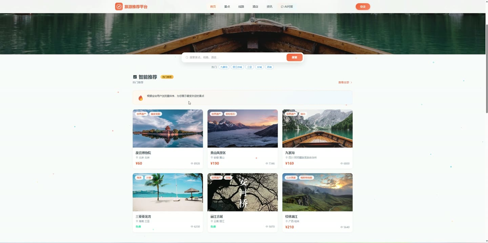
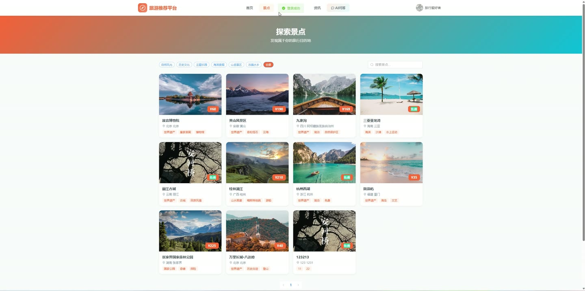
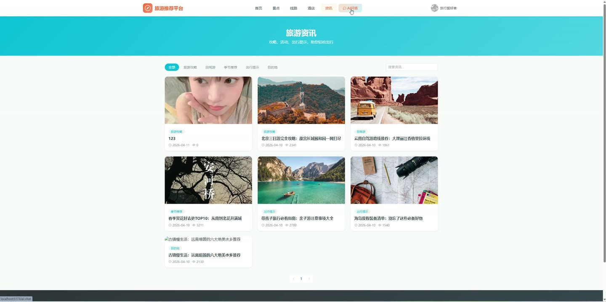
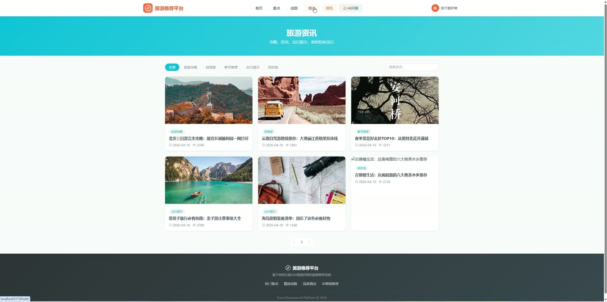
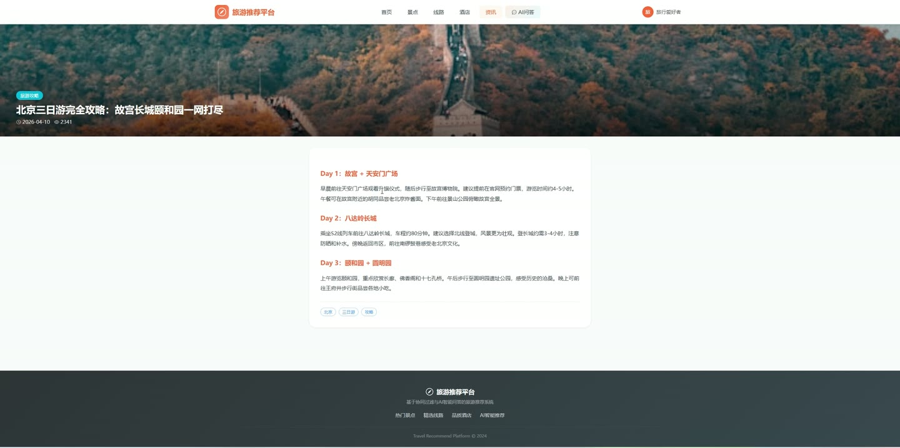

# (附文档)Springboot3+Vue3+MySQL 基于协同过滤+AI智能问答的旅游推荐平台

**技术栈**：Springboot3、Vue3、MySQL

### 系统简介

本系统是一个基于 Spring Boot 3 + Vue 3 + MySQL 的旅游推荐平台，采用前后端分离架构。平台整合了景点、旅游线路、酒店、旅游资讯等核心旅游资源，提供基于物品协同过滤的个性化推荐引擎与 AI 智能问答助手。系统包含普通用户端与管理员端两大角色，支持用户浏览、收藏、预订、AI 咨询以及管理员对全站资源与订单的集中管控。
 
### 核心功能
 
### 普通用户端

- 浏览景点列表（支持按关键词、分类、省份筛选，按浏览量排序）

- 查看景点详情（自动记录浏览量，展示门票价格、开放时间、标签等信息）

- 浏览旅游线路列表（支持关键词搜索，按创建时间排序）

- 查看线路详情（展示行程天数、出发地、目的地、价格、每日计划等）

- 预订旅游线路（填写联系人、电话、备注，生成订单号并记录行为）

- 浏览酒店列表（支持关键词与城市筛选，按星级排序）

- 查看酒店详情（展示房型列表、关联景点、关联线路，记录浏览行为）

- 预订酒店房间（选择房型，填写联系人信息，扣减库存并记录行为）

- 浏览旅游资讯列表（支持分类筛选与关键词搜索，仅展示已发布资讯）

- 查看资讯详情（自动增加阅读量）

- AI 智能问答（向 AI 助手提问旅游相关问题，支持平台内景点/线路/酒店数据上下文）

- 查看 AI 对话历史（展示最近 50 条问答记录）

- 用户注册（支持用户名、手机号、邮箱三种注册方式，含验证码验证）

- 用户登录（支持密码登录与验证码登录，含快速演示登录）

- 个人中心（查看与修改个人信息：昵称、头像、邮箱、手机号）

- 修改密码（需验证原密码）

- 收藏管理（对景点、线路、酒店、资讯进行收藏/取消收藏）

- 查看收藏列表（按类型筛选，展示收藏名称与时间）

- 我的订单（查看订单列表，支持取消待支付订单与模拟支付）

- 个性化推荐（基于协同过滤算法，根据浏览/收藏/预订行为推荐景点，展示推荐依据）

- 热门推荐（按浏览量排序展示全站热门景点）

- 文件上传（上传头像或封面图片）
 
### 管理员端

- 仪表盘统计（展示用户数、景点数、资讯数、线路数、酒店数、订单数）

- 景点管理（新增、编辑、删除景点，支持关键词搜索）

- 景点上下架（一键切换景点发布状态）

- 景点分类管理（新增、编辑、删除分类，支持排序）

- 旅游线路管理（新增、编辑、删除线路，支持关键词搜索）

- 线路上下架（一键切换线路发布状态）

- 酒店管理（新增、编辑、删除酒店，支持关键词搜索）

- 房型管理（按酒店查看房型列表，新增、编辑、删除房型，自动更新酒店最低价）

- 资讯管理（新增、编辑、删除资讯，支持关键词搜索）

- 资讯上下架（一键切换资讯发布状态）

- 用户管理（查看用户列表，支持关键词搜索）

- 用户状态管理（启用/禁用用户账户）

- 用户密码重置（将用户密码重置为 123456）

- 订单管理（查看所有订单，支持按订单号与状态筛选）

- 订单状态修改（手动更新订单状态）
 
### 技术栈

后端框架Spring Boot 3.x
ORMMyBatis-Plus
权限认证JWT（jjwt）
密码加密BCrypt（jBCrypt）
前端框架Vue 3
前端路由Vue Router
状态管理Pinia
构建工具Vite
数据库MySQL
HTTP 客户端Axios
AI 接口OpenAI 兼容 API / 本地规则引擎
 
### 交付内容

- 后端完整源码

- 前端完整源码

- 数据库初始化脚本

- 万字文档

## 界面展示

---

## 获取完整源码 + 万字文档

本仓库为项目介绍页。**完整前后端源码、数据库初始化脚本、万字项目文档**，请加微信 `kangkangcode`，或访问 [codekk.top](http://codekk.top) 获取。

可作课程设计 / 毕业设计参考，支持远程部署调试。